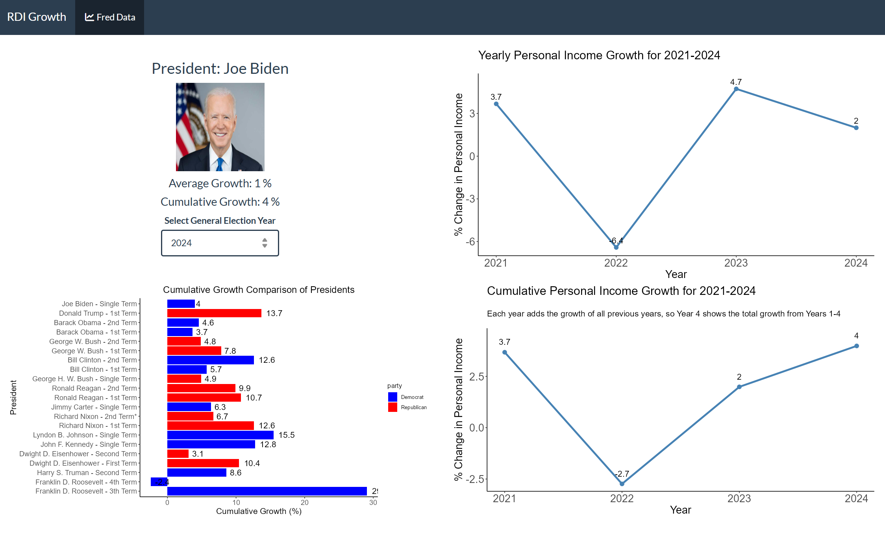

# 📊 RDI Growth & Electoral Accountability

Interactive macroeconomic dashboard built in **R Shiny** using the Federal Reserve Economic Data (FRED API). This project was developed to support and extend a **PhD working paper on economic voting and democratic accountability**.

The dashboard reconstructs U.S. real disposable personal income (RDI) growth dynamics across presidential terms and **challenges the findings of Healy & Lenz (2014)** by explicitly visualizing incumbents with cumulative versus yearly economic framing.

🔗 **Live App:** https://danbo.shinyapps.io/info_vote/

---

## 📌 Preview

---

## 📂 Data Source

Federal Reserve Economic Data (FRED)

| Series | Description | Link |
|-------|------------|------|
| **A229RX0** | Real Disposable Personal Income | https://fred.stlouisfed.org/series/A229RX0 |

---

## 🧠 Theoretical Motivation

I am particularly interested in how biases and perceptions related to economic performance influence voting behavior. Specifically, I analyze how affect for political figures in the U.S. influences retrospective evaluations of the economy. This dashboard is grounded in and directly challenges:

**Healy, Andrew & Lenz, Gabriel (2014)**  
*Substituting the End for the Whole: Bias in Democratic Accountability*  
https://doi.org/10.1111/ajps.12053

---

## 📈 Why RDI?

**Real Disposable Personal Income (RDI)** is among the most theoretically valid indicators of economic voting:

- Measures actual household purchasing power  
- Inflation-adjusted  
- Net of taxes and transfers  
- Closely tied to voter welfare

---

## 🧬 Growth Construction Logic

As in the original paper I calculate growth using natural logs, so cumulative growth is the sum of yearly growth.

The dashboard uses:

* growth_t = 100 × ( ln(RDI_t) − ln(RDI_{t−1}) )
* cumulative = Σ growth_t

This ensures mathematical consistency across yearly and cumulative frames.

---

## 🧠 Dashboard Architecture

The interface is organized as a **four-panel accountability system**:

---

### 🔹 Top-Left — Presidential Summary Panel

Displays the selected president:

- Name and portrait  
- Average yearly RDI growth  
- Total cumulative RDI growth  

Provides a **single-term summary view** of economic performance.

---

### 🔹 Bottom-Left — Cumulative Presidential Comparison

Stacked bar chart comparing **total cumulative RDI growth across all presidents**.

**Purpose:**  
Ensures comparability across presidents and parties using a consistent cumulative performance measure.

---

### 🔹 Top-Right — Yearly Growth Frame

Shows **year-by-year RDI growth** over the selected presidential term.

**Purpose:**  
Replicates the **short-term electoral framing** commonly used in mainstream media and statistical agencies.

---

### 🔹 Bottom-Right — Cumulative Growth Frame

Displays **total accumulated RDI growth over the full presidential term**.

**Purpose:**  
Presents the **overall macroeconomic outcome** of each presidency using cumulative growth — directly challenging election-year bias.

---

## 🧬 Unified Electoral Engine

- One election-year selector controls all four panels  
- All metrics are derived from a single FRED-based macroeconomic series  
- Presidential portraits are retrieved from the [White House Historical Archive](https://trumpwhitehouse.archives.gov/about-the-white-house/presidents/)
- Guarantees internal consistency across yearly and cumulative framing  
- Enables historical replay of accountability narratives

---

## 🛠 Technologies

- R Shiny  
- FRED API  
- ggplot2  
- dplyr / tidyr  
- jsonlite  
- Shiny Themes  

---